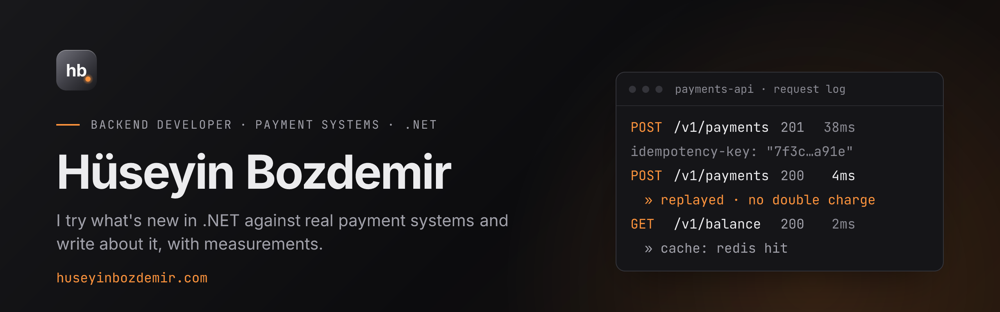

### Hi, I'm Hüseyin

Backend developer at **Octet Express**, working on payment infrastructure in fintech for the last 5 years.
I try what's new in .NET against the realities of payment systems, measure it, and write about it.

- **Payments:** virtual POS, 3D Secure, bank integrations (REST/SOAP), BKM Gateway, money transfers (EFT/FAST)
- **Measurement:** BenchmarkDotNet before opinions; allocations, throughput, p99
- **What's new:** C# and .NET features tried on real code before I recommend them
- **Depth:** microservices, idempotency, outbox, event-driven messaging, Redis caching, PostgreSQL query tuning

**Recent writing** (in Turkish) at [huseyinbozdemir.com](https://huseyinbozdemir.com)

<!-- BLOG:START -->
- [IMemoryCache mi, HybridCache mi?](https://huseyinbozdemir.com/blog/imemorycache-hybridcache)
- [C#'ta exception pahalı mı? .NET 10 ölçümleri](https://huseyinbozdemir.com/blog/csharp-exception-performansi)
- [Idempotency: para iki kez çekilmesin](https://huseyinbozdemir.com/blog/idempotency-odeme-sistemleri)
- [IDOR: ASP.NET Core'da \[Authorize\] neden yetmez?](https://huseyinbozdemir.com/blog/api-kaynak-aitligi-idor)
<!-- BLOG:END -->

**Stack:** C# · .NET · EF Core · PostgreSQL · SQL Server · Redis · RabbitMQ · Hangfire · Elasticsearch · Docker

**Find me:** [Website](https://huseyinbozdemir.com) · [LinkedIn](https://www.linkedin.com/in/huseyinbozdemir/) · [info@huseyinbozdemir.com](mailto:info@huseyinbozdemir.com)
