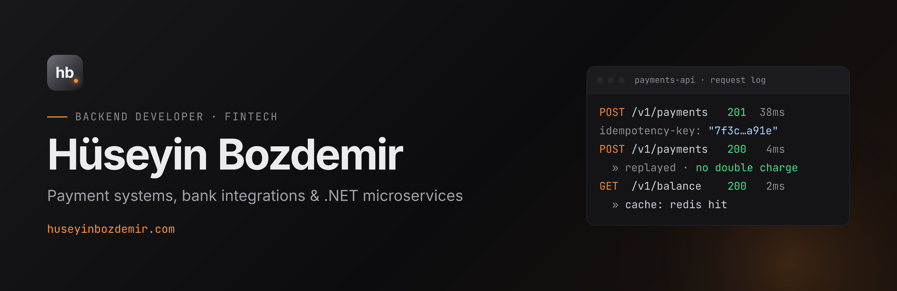

<a href="https://huseyinbozdemir.com">
  <picture>
    <source media="(prefers-color-scheme: dark)" srcset="banner-dark.png" />
    <source media="(prefers-color-scheme: light)" srcset="banner-light.png" />
    
  </picture>
</a>

### Hi, I'm Hüseyin

Backend developer at **Octet Express**, building payment infrastructure in fintech for the last 5 years.

- Payment systems, bank integrations (REST/SOAP), virtual POS, BKM Gateway and money transfers (EFT/FAST)
- Microservices & Clean Architecture — idempotency, outbox pattern, event-driven messaging
- Performance and caching — Redis, distributed cache, query optimization
- Writing about backend engineering at **[huseyinbozdemir.com](https://huseyinbozdemir.com)**

**Stack:** C# · .NET · EF Core · PostgreSQL · SQL Server · Redis · RabbitMQ · Hangfire · Elasticsearch · Docker

**Find me:** [Website](https://huseyinbozdemir.com) · [LinkedIn](https://www.linkedin.com/in/huseyinbozdemir/) · [X](https://x.com/huseinbozdemir) · [info@huseyinbozdemir.com](mailto:info@huseyinbozdemir.com)
